<div align="center">

# Asyre Presentation

**Claude 直接在终端给你生成浏览器可跑的演示文稿**

43 视觉风格 · 24 结构模板 · 114 场景实例 · 140 GSAP 动画 · 零依赖

[Install](#install) · [Try it](#try-it-in-30-seconds) · [See it](#see-it) · [Architecture](#architecture)

</div>

---

## 这是什么

Claude Code 的 skill。对 Claude 说一句话（"做个 pitch deck" / "给这个 PPT 换个风格" / "把这张截图重画"），直接拿到一个**浏览器可跑的单 HTML 文件**——内嵌 CSS + GSAP 动画 + 可选 AI 生成的每页概念艺术背景。

**不是什么：** 不是模板库。不是 PPT 替代品。是 Claude 的**生成能力**——同一份内容，可以换 43 种视觉风格、24 种结构、任选场景叙事弧、140 个动画效果随意组合。

---

## Install

```bash
git clone https://github.com/Qihe-agent/next-slide-impeccable.git \
  ~/.claude/skills/next-slide-impeccable
```

重启 Claude Code，skill 自动识别。就这一步。

---

## Try it in 30 seconds

### 场景 1 · 从零做一个 deck

```
我要做一个产品发布会 pitch，讲我们新的 AI code review 工具。
目标受众是投资人，15 页左右，英文。
```

Claude 会问你 5 个问题（语言 / 用途 / 长度 / 有没有初稿 / 可编辑），给你 3 个风格预览让你选，然后生成完整的单 HTML。

### 场景 2 · 把 PPT 换成 HTML

```
把这个文件转成 HTML：/Users/me/Downloads/Q4-review.pptx
```

Claude 抽内容 → 问风格偏好 → 输出。

### 场景 3 · 截图重绘成我们的风格

```
（贴一张论文里的表格或框架截图）
把这个重画进我的 slide，用 Asyre Dark Gold 风格
```

Claude 匹配到 24 种结构之一，找对应的 QA 过的参考文件，照抄布局换内容。

### 场景 4 · 增强现有 deck

```
这个 HTML slide 的第 5 页太空了：/path/to/deck.html
能不能加点动画和图表
```

Claude 读文件 → 识别当前风格 → 加 GSAP timeline + 数据图 + 可选循环动效。

---

## See it · 24 Structure Templates

每一张都是跑通、过了 QA、修完了所有踩坑的真实实现。点图进入对应的 HTML（可直接 clone 下来打开看完整动画）。

<table>
<tr>
<td align="center" width="25%"><a href="structures/01-funnel.html"><br/><b>01 · 漏斗</b></a><br/><sub>Funnel · 转化路径</sub></td>
<td align="center" width="25%"><a href="structures/02-hub-spoke.html">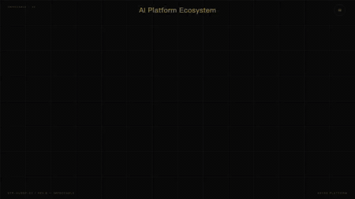<br/><b>02 · 中心辐射</b></a><br/><sub>Hub-Spoke · 生态图</sub></td>
<td align="center" width="25%"><a href="structures/03-iceberg.html"><br/><b>03 · 冰山</b></a><br/><sub>Iceberg · 20/80 隐喻</sub></td>
<td align="center" width="25%"><a href="structures/04-bridge.html">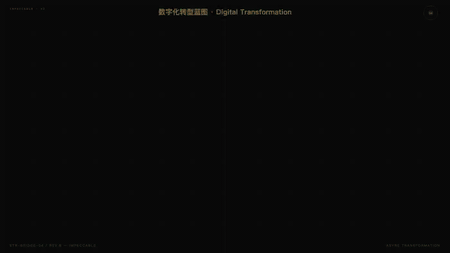<br/><b>04 · 转型之桥</b></a><br/><sub>Bridge · Before/After</sub></td>
</tr>
<tr>
<td align="center"><a href="structures/05-radar-chart.html"><br/><b>05 · 雷达图</b></a><br/><sub>Radar · 30° 双光束扫描</sub></td>
<td align="center"><a href="structures/06-dashboard.html">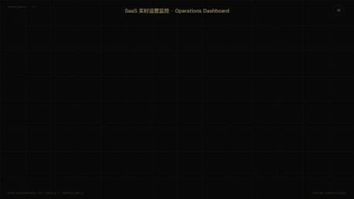<br/><b>06 · 仪表盘</b></a><br/><sub>Dashboard · KPI + 图表</sub></td>
<td align="center"><a href="structures/07-bento-grid-dense.html">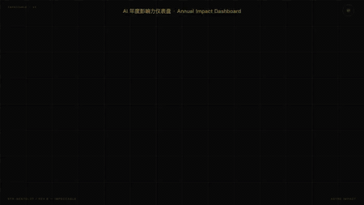<br/><b>07 · 格子仪表盘</b></a><br/><sub>Bento · 3×3 KPI</sub></td>
<td align="center"><a href="structures/08-comparison-matrix-dense.html">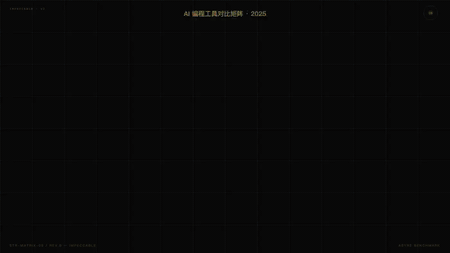<br/><b>08 · 多维矩阵</b></a><br/><sub>Matrix · N 产品 × M 维度</sub></td>
</tr>
<tr>
<td align="center"><a href="structures/09-circular-flow.html">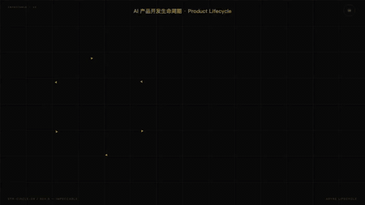<br/><b>09 · 循环流程</b></a><br/><sub>Circular · 生命周期</sub></td>
<td align="center"><a href="structures/10-hierarchical-layers.html">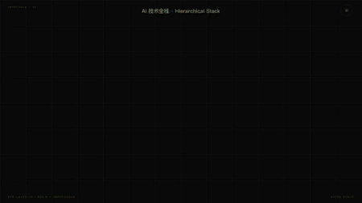<br/><b>10 · 层级堆叠</b></a><br/><sub>Layers · 技术栈 / 协议栈</sub></td>
<td align="center"><a href="structures/11-linear-progression.html">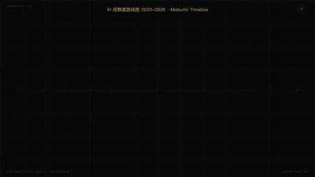<br/><b>11 · 线性进程</b></a><br/><sub>Linear · 时间线 / 里程碑</sub></td>
<td align="center"><a href="structures/12-swot-analysis.html">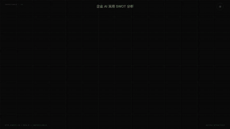<br/><b>12 · SWOT 分析</b></a><br/><sub>SWOT · 四象限</sub></td>
</tr>
<tr>
<td align="center"><a href="structures/13-venn-diagram.html">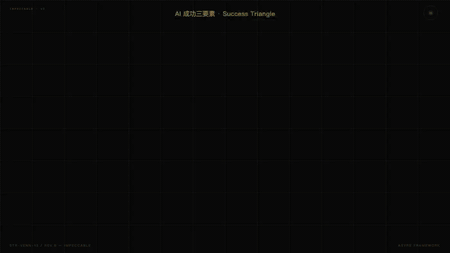<br/><b>13 · 维恩图</b></a><br/><sub>Venn · 交集 / 共同点</sub></td>
<td align="center"><a href="structures/14-tree-branching.html">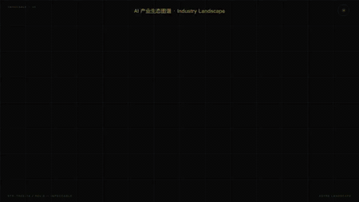<br/><b>14 · 树状分支</b></a><br/><sub>Tree · 组织架构</sub></td>
<td align="center"><a href="structures/15-winding-roadmap.html">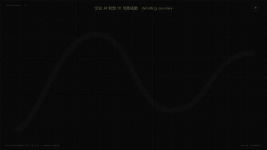<br/><b>15 · 蜿蜒路线</b></a><br/><sub>Roadmap · S 曲线</sub></td>
<td align="center"><a href="structures/16-story-mountain.html">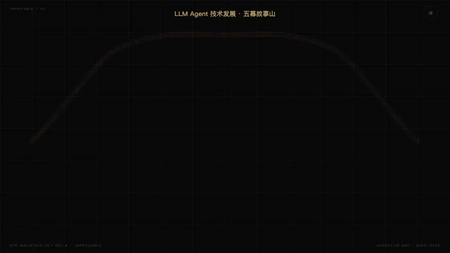<br/><b>16 · 故事山</b></a><br/><sub>Story Arc · 5 幕叙事</sub></td>
</tr>
<tr>
<td align="center"><a href="structures/17-structural-breakdown.html">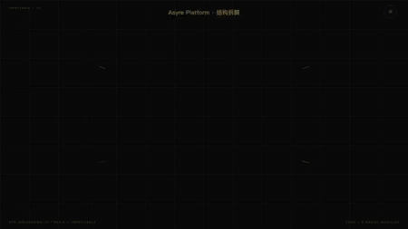<br/><b>17 · 结构拆解</b></a><br/><sub>Breakdown · 中心 × 8 模块</sub></td>
<td align="center"><a href="structures/18-dense-modules.html">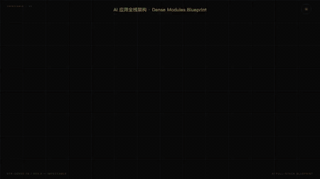<br/><b>18 · 密集模块</b></a><br/><sub>Dense · 16 模块 · 4 层</sub></td>
<td align="center"><a href="structures/19-periodic-table.html">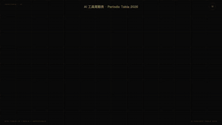<br/><b>19 · 周期表</b></a><br/><sub>Periodic · 24 元素分类</sub></td>
<td align="center"><a href="structures/20-comparison-table.html"><br/><b>20 · 对比表</b></a><br/><sub>Compare · 3 列 × 8 行</sub></td>
</tr>
<tr>
<td align="center"><a href="structures/21-binary-comparison.html">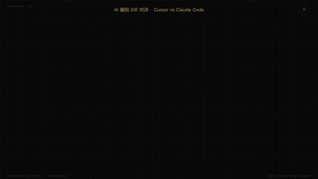<br/><b>21 · 二元对比</b></a><br/><sub>A vs B · VS 砸下</sub></td>
<td align="center"><a href="structures/22-jigsaw.html">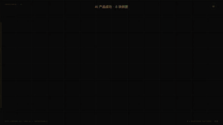<br/><b>22 · 拼图</b></a><br/><sub>Jigsaw · 6 块互锁</sub></td>
<td align="center"><a href="structures/23-isometric-map.html">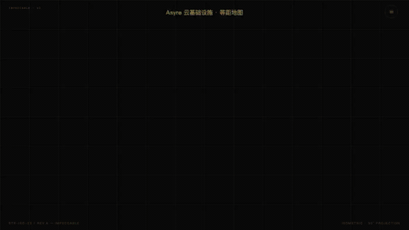<br/><b>23 · 等距地图</b></a><br/><sub>Isometric · 30° 3D</sub></td>
<td align="center"><a href="structures/24-comic-strip.html">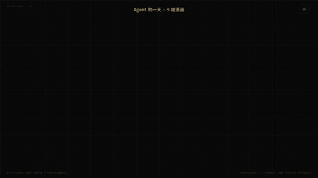<br/><b>24 · 漫画格</b></a><br/><sub>Comic · 6 panel + action</sub></td>
</tr>
</table>

**详细固化点 / 使用方式 / 场景映射见 [`structures/STRUCTURES_INDEX.md`](structures/STRUCTURES_INDEX.md)**。

**43 个视觉风格：** `open style-gallery.html`（clone 后本地打开）· 或单独跑 [`styles/`](styles/) 下任一个 HTML 看效果。

**114 个场景实例：** [`scenarios/`](scenarios/) 下。`pitch-deck-orbital-midnight.html` / `product-launch-xiaomi-neon.html` / `chinese-brand-wine-ink.html` 这些可以直接改内容用。

---

## 能触发这个 skill 的说法

```
"做个 pitch deck"
"做个产品发布会"
"准备答辩演讲"
"给我做个数据 dashboard"
"把这个 PPT 转成 HTML"
"把这张截图重画进 slide"
"画一个漏斗分析"
"做一张 AI 转型路线图"
"做个雷达图对比 GPT / Claude / Gemini"
"convert this .pptx to HTML"
"make a keynote-style HTML slide deck"
"做演示" / "准备演讲" / "画信息图"
```

描述字段故意写得"pushy"——即使用户没说 "presentation"，只要提到 slides / deck / 演示 / 信息图 / 结构图 / 截图重绘，skill 就会触发。

---

## Architecture

<details>
<summary>点开看 skill 内部结构（进阶阅读）</summary>

```
next-slide-impeccable/
├── SKILL.md                        (518 行 · Agent 入口 · 决策骨架 + 跳转指针)
├── README.md                       (你现在看的)
├── viewport-base.css               (所有 slide 强制 inline 的 CSS)
├── animation-{index.json, snippets.js, showcase.html}   (140 GSAP 效果 3 层库)
├── gallery.html · style-gallery.html
│
├── references/                     (16 个深度参考，按需 progressive disclosure)
│   ├── STYLE_PRESETS.md            (43 风格规格 + CSS 变量)
│   ├── STRUCTURE_PRESETS.md        (24 结构定义 + 硬规则 0-11)
│   ├── generation-hard-rules.md    (生成时的坐标/动画/布局铁律)
│   ├── ANIMATION_PATTERNS.md       (15 核心 pattern 方法论)
│   ├── animation-combos.md         (10 个预设 timeline)
│   ├── phase-2.5-custom-style.md   (从 .impeccable.md 合成自定义视觉系统)
│   ├── phase-2.8-bg-images.md      (AI 背景图 · Gemini 3 Pro)
│   ├── phase-3-details.md          (bilingual / overlay / impeccable elevation)
│   ├── phase-4-conversions.md      (PPT + Markdown 转换)
│   ├── phase-5-6-delivery.md       (交付 + PDF 导出 · 含 100+ 行 PDF 踩坑)
│   ├── mode-g-screenshot-redraw.md (截图重绘流程)
│   ├── html-template.md            (完整 HTML 骨架)
│   ├── ASYRE_BRAND_PRESET.md       (Asyre Dark Gold 品牌 + AI prompt 系统)
│   ├── ASHER_PREFERENCES.md        (作者偏好：SVG 非 emoji / 170% base / 等)
│   ├── DESIGN_ELEVATION.md         (Impeccable 设计原则)
│   ├── SCENARIO_TEMPLATES.md       (场景叙事弧 + 扩展 slide 类型)
│   └── archive/                    (4 个开发历史文档，保留不读)
│
├── structures/                     (25 个 QA 过的 canonical HTML — 下次生成同类直接照抄)
│   ├── STRUCTURES_INDEX.md         (索引 + 使用方式 + 场景映射表)
│   └── 01-funnel.html ... 25-index.html
│
├── styles/                         (43 个风格 live HTML)
├── scenarios/                      (114 个场景实例 live HTML)
├── scripts/                        (extract-pptx.py 等工具)
└── landing/                        (landing 页模板)
```

### 工作流

```
Phase 0  Detect Mode        (新建 / PPT 转 / 增强 / 截图重绘 / Markdown 转)
Phase 1  Content Discovery  (用户问答，收集素材)
Phase 1.5 Design Context    (可选 · 合成 .impeccable.md)
Phase 2  Style Discovery    (从 43 预设选，或从 context 合成)
Phase 2.8 AI 背景图          (可选 · Gemini 3 Pro)
Phase 3  Generate           (生成单 HTML · 内嵌 viewport-base.css + GSAP)
   └ 遇结构图 → 查 structures/NN.html 照抄
Phase 3.5 QA                (viewport / 字号 / 密度自查)
Phase 4  PPT / MD 转换
Phase 5-6 Delivery + PDF 导出
```

### 动画三层

```
animation-combos.md  ← 先查 10 个 timeline combo（能对上就直接用）
    ↓ 没匹配
animation-index.json ← 按 mood / purpose / applicable_to 筛单个 effect
    ↓ 拿到 ID
animation-snippets.js ← effects.play_XX(scope) 调函数
```

</details>

---

## Powered by

- **GSAP 3.12.5** · 动画引擎 (~30KB gzipped)
- **Google Fonts** · Noto Serif SC / Space Grotesk / JetBrains Mono 默认栈
- **Gemini 3 Pro Image Preview** · 可选 per-slide AI 背景图
- **零运行时** · 纯 HTML + CSS + inline JS · 无打包无构建

---

## Contributing

Skill 结构在 [`SKILL.md`](SKILL.md)，硬规则在 [`references/generation-hard-rules.md`](references/generation-hard-rules.md) 和 [`references/STRUCTURE_PRESETS.md`](references/STRUCTURE_PRESETS.md)（§硬规则 0-11）。

**踩过坑的情况**都固化在了 [`structures/`](structures/) 里的 25 个参考文件中——加新结构前先读 `STRUCTURES_INDEX.md` 看有没有能复用的布局。

PR / issue 欢迎在 [Qihe-agent/next-slide-impeccable](https://github.com/Qihe-agent/next-slide-impeccable) 提。

---

<div align="center">
Made with 💛 by <a href="https://github.com/Qihe-agent">Qihe-agent</a> · Part of the <a href="https://github.com/Qihe-agent">Asyre</a> ecosystem
</div>
